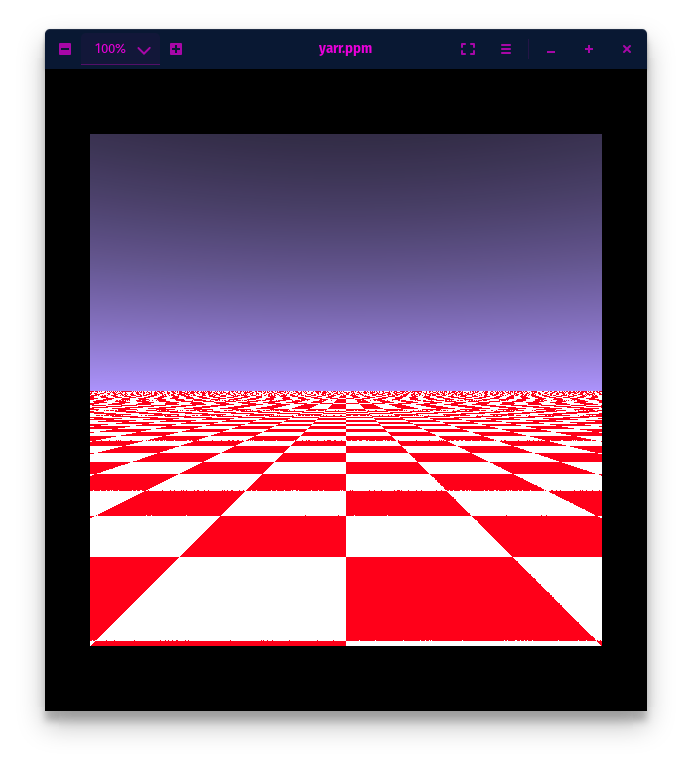
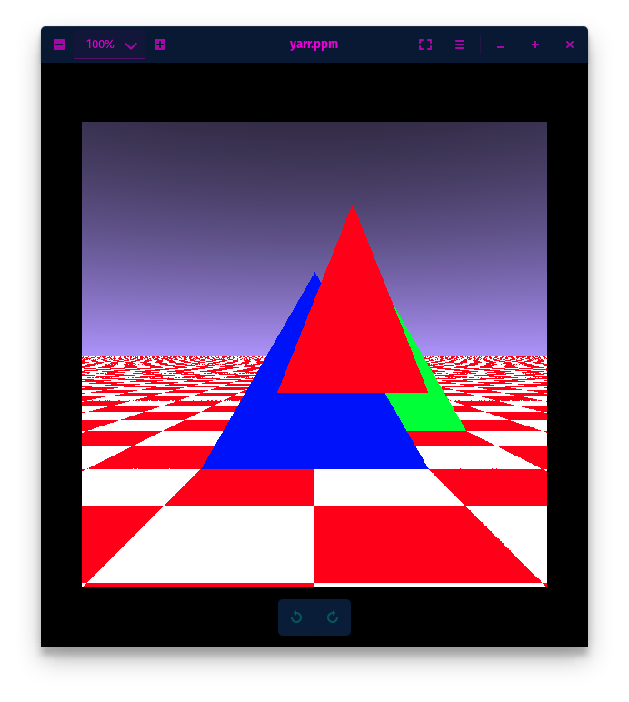
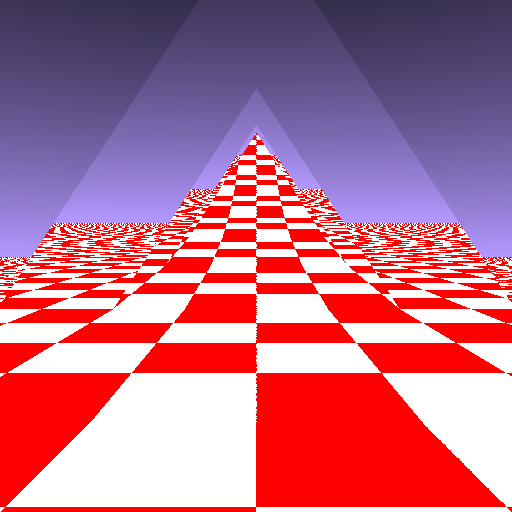
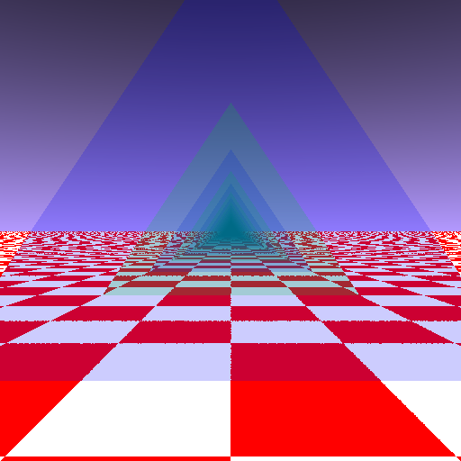
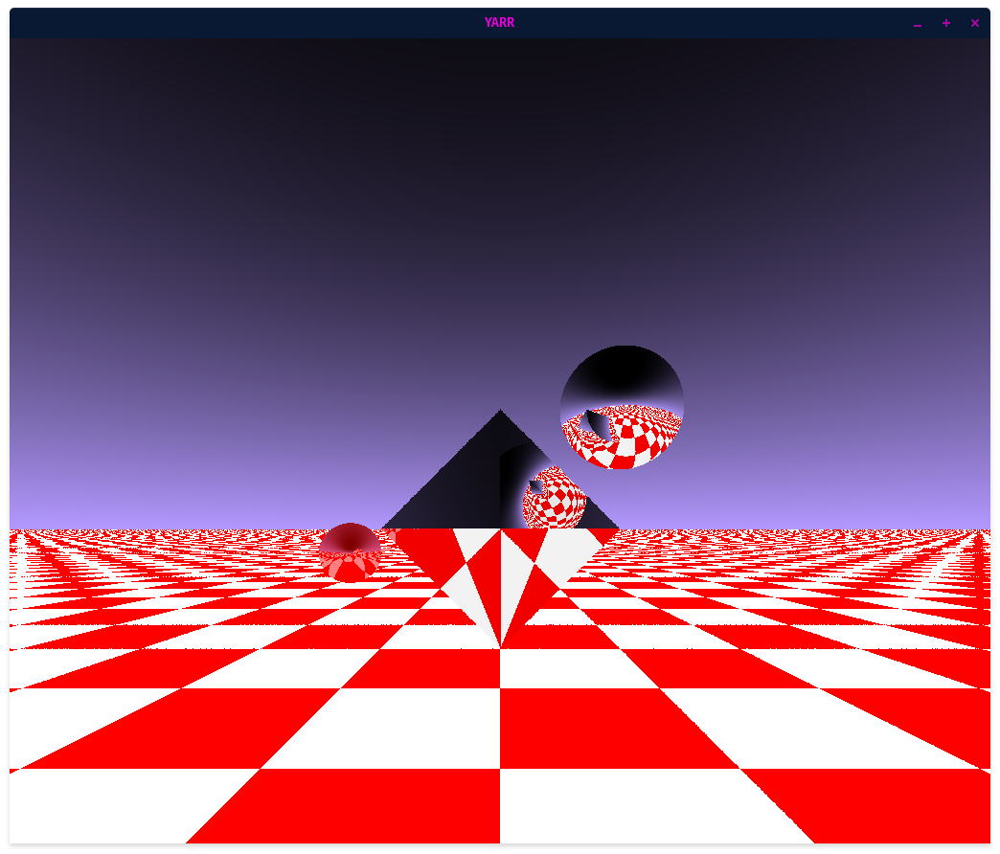
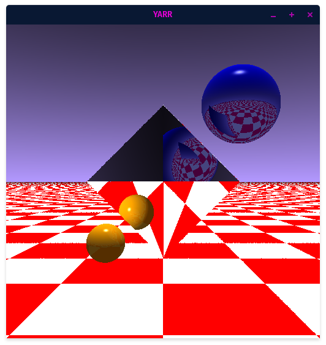
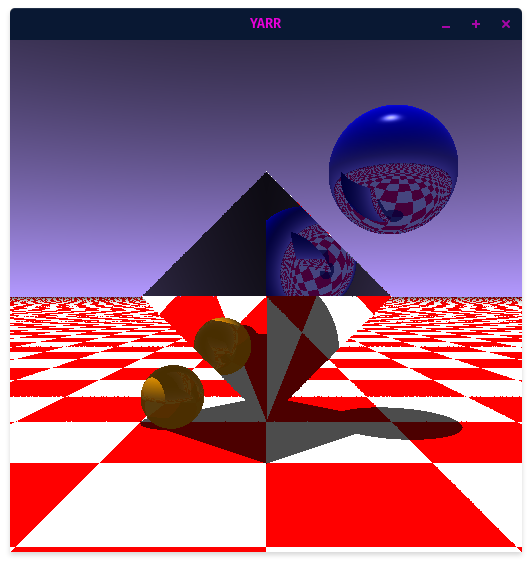
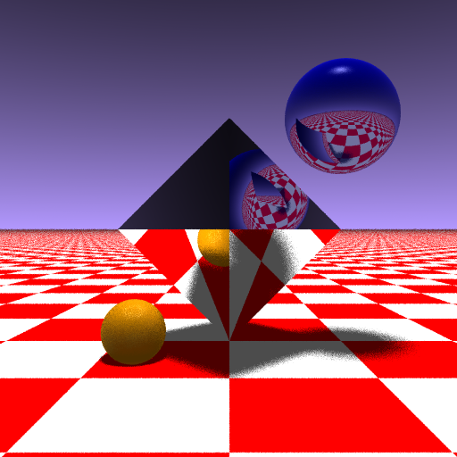
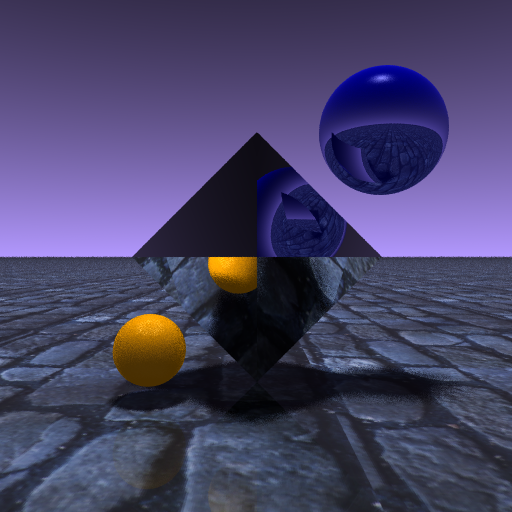

# Yet Another Relativistic Renderer (YARR)

A CUDA-accelerated ray-tracing renderer, with relativistic effects planned.

Built with the help of [Nikolaus Mayer](https://github.com/nikolausmayer/raytracing-from-scratch/)

  
Progress Images

  ## Sky and Ground
  

  ## Plane Depth
  

  ## Triangles
  

  ## Mirrors
  

  ## Light Energy
  

  ## Spheres
  

  ## Phong Lighting
  

  ## Shadows
  

  ## Antialiasing, Soft Shadows, Depth of Field
  

  ## Ground Texture
  

  ## Rotation Matrices, Callbacks
  

## Installation

### CSFML

We use SFML with C bindings (CSFML) to open a window and display the renders

[SFML Installation](https://www.sfml-dev.org/tutorials/2.5/start-linux.php)

[CSFML Bindings](https://www.sfml-dev.org/download/csfml/)

### OpenCV

I used [this installation tutorial](https://docs.opencv.org/4.x/d7/d9f/tutorial_linux_install.html).
