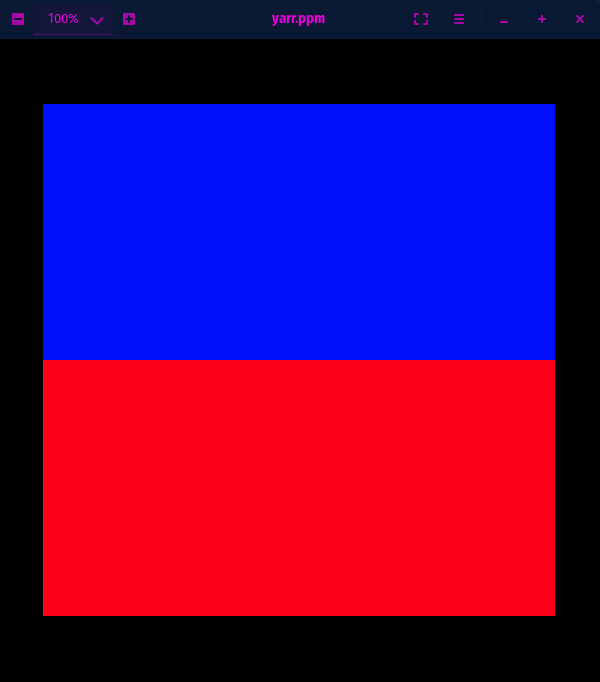

# Yet Another Relativistic Renderer (YARR)

A CUDA-accelerated ray-tracing renderer, with relativistic effects planned.

Built with the help of [Nikolaus Mayer](https://github.com/nikolausmayer/raytracing-from-scratch/)

<details>
    <summary>Progress Images</summary>

    ## Sky and Ground
    
</details>

## Installation

### CSFML

We use SFML with C bindings (CSFML) to open a window and display the renders

[SFML Installation](https://www.sfml-dev.org/tutorials/2.5/start-linux.php)
[CSFML Bindings](https://www.sfml-dev.org/download/csfml/)

### OpenCV

We need to build a version of OpenCV that includes CUDA functionality. I chose `3.4.0` because
every other version had compilation issues on my system. This is a major version behind the most
recent version at the time of writing this (`4.5.5`) so the API will be different than many modern
tutorials.

```bash
OPENCV_VERS="3.4.0"
wget -O opencv.zip https://github.com/opencv/opencv/archive/refs/tags/${OPENCV_VERS}.zip
wget -O opencv_contrib.zip https://github.com/opencv/opencv_contrib/archive/refs/tags/${OPENCV_VERS}.zip
unzip opencv.zip
unzip opencv_contrib.zip

cd opencv-${OPENCV_VERS}
mkdir build && cd build

# Replace -D CUDA_ARCH_BIN=7.5 with -D CUDA_ARCH_BIN=<whatever your GPU's CUDA compute compatibility is>
cmake -D CMAKE_BUILD_TYPE=RELEASE \
      -D CMAKE_INSTALL_PREFIX=/usr/local \
      -D INSTALL_PYTHON_EXAMPLES=OFF \
      -D INSTALL_C_EXAMPLES=OFF \
      -D OPENCV_ENABLE_NONFREE=ON \
      -D WITH_CUDA=ON \
      -D WITH_CUDNN=OFF \
      -D OPENCV_DNN_CUDA=ON \
      -D ENABLE_FAST_MATH=1 \
      -D CUDA_FAST_MATH=1 \
      -D CUDA_ARCH_BIN=7.5 \
      -D WITH_CUBLAS=1 \
      -DBUILD_opencv_cudacodec=OFF \
      -DBUILD_opencv_dnn_modern=OFF \
      -D OPENCV_EXTRA_MODULES_PATH=~/opencv_contrib-${OPENCV_VERS}/modules \
      ..

make -j$(nproc)
make install
```
